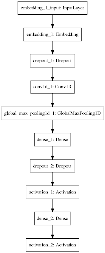

# Device-specific-context-utterance-classification-for-Intelligent-devices

## Introduction
Utterance is any sentence given to an intelligent device. Valid utterances are the sentences for which the device could perform some action. If no action is possible for a sentence, then it is simply an invalid utterance. This project describes a method for utterance classification that does not require manual transcription of training data.
It emphasizes on classifying any given input as a valid or invalid utterance, based on the action coupled with the utterance.
 
## Dataset
The dataset used for training is created from parsing out the SQuAD dataset and combining it with the SPAADIA dataset.
Stanford Question Answering Dataset (SQuAD) is a reading comprehension dataset, consisting of questions posed by crowdworkers on a set of Wikipedia articles, where the answer to every question is a segment of text, or span, from the corresponding reading passage, or the question might be unanswerable.
Speech Act Annotated DIAlogues is a small corpus of 35 timetable information and booking interactions between a female call-centre agent and her callers. The sentences are categorized into questions, commands and statements.

## Approach
The system set up consists of two major components i.e (1)CNN Architecture which classifies each of the sample input as a Question, Statement or Command. Further processing is required in the case of a command i.e (2) Verb-Noun Context Analyser - which verifies if the command is in context with a device.

## Classifying Sentences
In writing and speaking, there are four basic types of sentences that are used for different purposes 1) declarative sentences 2) interrogative sentences 3) imperative sentences 4) exclamatory sentences. A declarative sentence is the most basic type of sentence. Its purpose is to relay information, and it is punctuated with a period. These sentences make statements, whether of fact or opinion. In device context, as  declarative sentences are just facts and opinions they have no action coupled. Hence these sentences can be invalid in the first filtration. Interrogative sentences interrogate, or ask questions. These are direct questions, and start with question words like "how" or "why," but others are yes/no questions that begin with the verb instead of the noun. An answer is anything that satisfies the conditions set by the question and it necessary for the device to respond to each question being asked i.e, questions are coupled with answer as a responsive action, hence questions can be marked valid utterances.Exclamatory sentences are like declarative sentences in that they make a statement instead of asking a question, but their main purpose is to express strong emotion hence like declarative sentences they can be marked invalid.Imperative sentences do not simply state a fact but rather tell someone to do something. These can be in the form of friendly advice, basic instructions or more forceful commands.Imperative sentences when given as an input to a device, they convey a command to be executed or an action to be performed, but not necessarily all commands are in device context some may be irrelevant for a device i.e, it is out of the domain of the device. Hence this is classified by the next model based on the context of the imperative sentence. 

## CNN for sentence classification
Even though the originally intended purpose of Convolutional Neural Networks was to recognize images, our model is built using CNN mainly for the mathematical operations performed by it’s hidden layers which allows the network to identify features from the input data that may not have been learnt by other models such as the Multilayer perceptron. Also, of all the models that were developed the CNN model was able to provide an inference in the least amount of time. One aspect of implementing a CNN is that the input vectors are to be padded so as to have the desired input size for the model.

## Model

 

## CNN model parameters
* The input layer is defined with max_words of 10000 and an input_length of 500 with the dimension of the embedding set to 50.
* The convolutional layer is defined as one dimension with a size of 250 features for the input vector and the generated output feature matrix is of the size 250, the stride set for this convolution is of 1. 
* The output feature vector is given to a fully connected layer with a set of hidden dimensions of 150. 
* The output of the fully connected layer is connected to a softmax layer which reduces the output to 3 classes.
* The model is optimized using the adam optimizer and the loss implemented is categorical cross entropy.

## Noun-Verb Context Analysis
After the CNN classifies an input instance as 'Command', it requires further processing for the final verdict as valid or invalid. For this task a dictionary is brought into existence, which contains a one-many mapping of verb to noun, i.e verb is the 'keyword' and 'noun' is the value. This method is very efficient since there are very less verbs in device context. Examples of verbs in device context are - call, message, open, play whereas examples for nouns which map to such verbs for this specific task  are - music, name of any application, the name of any contact etc.
The Analyser shown in figure 3 as key pair dictionary makes use of Part Of Speech tagging functionality provided by NLTK library and further lemmatizes the extracted noun/verb and converts the word into its base form.  If the noun-verb pair present in our input instance is present in the dictionary, then the sentence is classified as valid, else it is classified as 'invalid'.
 
